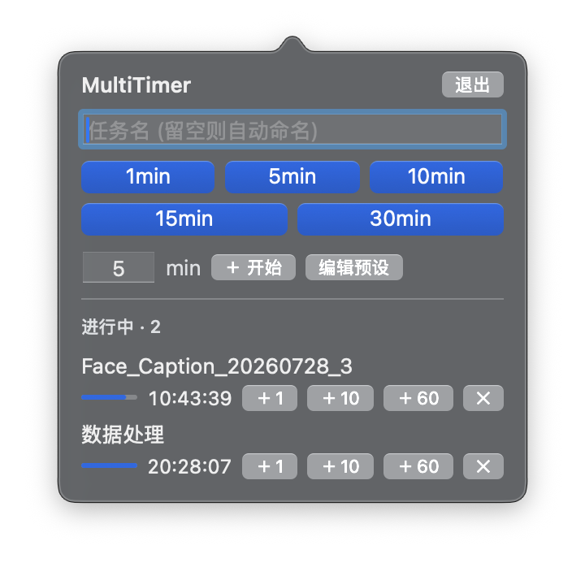

# MultiTimer

一款轻量、原生、专注的 macOS 菜单栏多任务倒计时工具。

[](https://www.apple.com/macos/)
[](https://www.python.org/)
[](LICENSE)

MultiTimer 常驻菜单栏，不占用 Dock 空间。输入任务名称并选择一个时间，即可同时启动多个倒计时；所有界面都使用 AppKit 原生组件，会自动跟随系统的浅色或深色外观。

## 界面预览

| 浅色模式 | 深色模式 |
| :---: | :---: |
|  |  |

## 功能特性

- **多任务并行**：同时运行多个互不影响的倒计时。
- **快速开始**：内置 1、5、10、15、30 分钟预设，也支持输入任意分钟数。
- **灵活调整**：倒计时过程中可一键增加 1、10 或 60 分钟，也可随时取消。
- **可编辑预设**：自定义预设名称和时长，满足不同工作流。
- **清晰进度**：显示剩余时间和进度条，最后 10 秒使用红色提示。
- **到时通知**：通过 macOS 原生通知提醒，并可直接标记“已检查”。
- **快速重启**：计时结束后可按原时长重新开始。
- **状态恢复**：预设和未结束的倒计时保存在本地，重启应用后自动恢复。
- **系统原生体验**：AppKit / PyObjC 构建，跟随系统主题，点击面板外部自动收起。
- **安静驻留**：仅显示在菜单栏，不在 Dock 中显示。

## 系统要求

- macOS
- Python 3.9 或更高版本（从源码运行或自行打包时）

> MultiTimer 使用 AppKit 和 macOS 通知中心，因此不支持 Windows 或 Linux。

## 快速开始

### 从源码运行

```bash
git clone https://github.com/EchoForger/multi-timer.git
cd multi-timer

python3 -m venv .venv
source .venv/bin/activate
python3 -m pip install --upgrade pip
python3 -m pip install .

multitimer
```

开发时也可以在安装依赖后直接运行：

```bash
python3 multitimer.py
```

首次启动时，macOS 可能会询问是否允许 MultiTimer 发送通知。允许后才能收到计时结束提醒。

### 打包为 macOS App

仓库内已包含 PyInstaller 配置：

```bash
python3 -m venv .venv
source .venv/bin/activate
python3 -m pip install --upgrade pip
python3 -m pip install . pyinstaller
pyinstaller MultiTimer.spec --noconfirm --clean
```

构建完成后，应用位于 `dist/MultiTimer.app`。可以直接打开，也可以复制到“应用程序”目录：

```bash
cp -R dist/MultiTimer.app /Applications/
open /Applications/MultiTimer.app
```

若希望开机自动启动，请前往：**系统设置 → 通用 → 登录项**，然后添加 `MultiTimer.app`。

## 使用方法

1. 点击菜单栏中的计时器图标。
2. 输入任务名称；留空时会自动使用“任务 1”“任务 2”等名称。
3. 点击预设按钮，或输入自定义分钟数并点击“开始”。
4. 计时过程中可使用 `+1`、`+10`、`+60` 延长时间，或点击 `×` 取消。
5. 时间到后，选择“重新计时”或“已检查”。

点击“编辑预设”，按每行 `名称=分钟` 的格式维护快捷时长，例如：

```text
番茄钟=25
短休息=5
深度工作=90
```

分钟数支持小数，保存时会换算为秒。

## 数据与隐私

MultiTimer 不需要账户，不包含遥测，也不会上传数据。预设和倒计时状态仅保存在本机：

```text
~/.config/multitimer/state.json
```

删除该文件即可恢复默认预设并清除保存的倒计时。

## 常见问题

### 收不到到时通知

请在 **系统设置 → 通知 → MultiTimer** 中允许通知。若应用仍在运行，通知会以横幅和通知中心项目的形式显示。

### 菜单栏里没有看到图标

MultiTimer 是纯菜单栏应用，不会出现在 Dock 中。菜单栏空间不足时，macOS 可能会隐藏部分图标。

### 退出后倒计时还会提醒吗？

不会。当前版本需要 MultiTimer 保持运行。应用重新启动后，会恢复尚未结束的倒计时。

## 项目结构

```text
.
├── multitimer.py       # 应用逻辑与原生界面
├── MultiTimer.spec     # PyInstaller 打包配置
├── pyproject.toml      # Python 包元数据与依赖
├── light.png           # 浅色模式截图
├── dark.png            # 深色模式截图
└── TODO.md             # 后续计划
```

## 参与贡献

欢迎提交 Issue 和 Pull Request。开始开发前，建议先创建独立分支，并确保代码至少可以通过基础语法检查：

```bash
python3 -m compileall -q multitimer.py
```

如果要修改界面，请同时在浅色和深色模式下检查布局、文字换行和计时结束状态。较大的功能改动建议先创建 Issue 讨论设计。

## 许可证

本项目基于 [MIT License](LICENSE) 开源。
