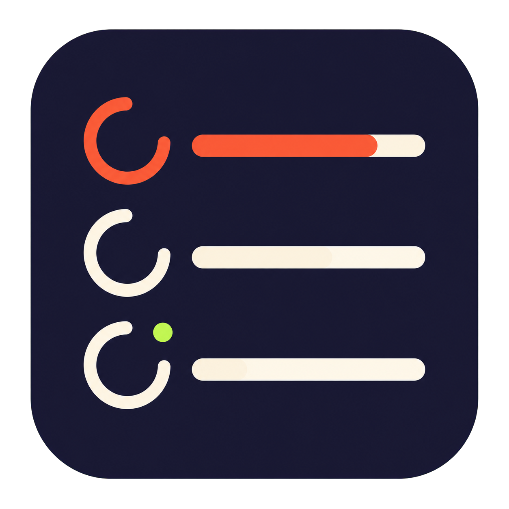

<div align="center">



# MultiTimer

**多个倒计时，一个节奏。**

一款轻巧、原生的 macOS 菜单栏多任务倒计时器。

[](https://github.com/EchoForger/multi-timer/releases/latest)
[](https://www.apple.com/macos/)
[](LICENSE)
[](https://echoforger.github.io/multi-timer/)

<p>
  <a href="https://github.com/EchoForger/multi-timer/releases/latest">
    
  </a>
</p>

<picture>
  <source media="(prefers-color-scheme: dark)" srcset="dark.png">
  <source media="(prefers-color-scheme: light)" srcset="light.png">
  
</picture>

</div>

## 安装

### 下载 DMG

前往 [Latest Release](https://github.com/EchoForger/multi-timer/releases/latest) 下载 `MultiTimer-<版本号>.dmg`：

1. 打开 DMG。
2. 将 `MultiTimer.app` 拖入“应用程序”文件夹。
3. 启动 MultiTimer，计时器图标会出现在菜单栏。

### Homebrew

```bash
brew tap EchoForger/tap
brew install --cask multi-timer
```

更新到最新版：

```bash
brew update
brew upgrade --cask multi-timer
```

卸载：

```bash
brew uninstall --cask multi-timer
```

### 首次打开

当前版本尚未经 Apple 签名和公证。如果 macOS 阻止启动：

1. 在 Finder 的“应用程序”中找到 `MultiTimer.app`。
2. 右键应用，选择“打开”。
3. 在确认窗口中再次点击“打开”。

首次启动时请允许 MultiTimer 发送通知，否则计时结束时无法显示提醒。

## 怎么用

1. 点击菜单栏中的计时器图标。
2. 输入任务名，或留空自动命名。
3. 用先慢后快的指数拉杆选择 0 到 24 小时的时长，或直接输入目标时间。
4. 创建区和卡片时间均显示为 `HH:MM:SS`；点击小时、分钟或秒会单独高亮并可直接输入。双击计时名称，或在 Force Touch 触控板上用力按压，可行内改名。
5. 运行中可以暂停、复制和置顶，列表可按最近到期自动排序。
6. 点击“秒表”开始正向计时，并使用“计圈”记录圈次。
7. 时间到后，选择“重新计时”或“已检查”。

### 番茄钟

番茄钟位于普通计时器列表之外，默认工作 25 分钟、休息 5 分钟。工作结束后自动开始休息；开启自动循环后，休息结束自动开始下一轮工作，否则等待你点击“开始工作”。工作和休息均支持暂停、继续、跳过与停止，菜单栏会优先显示 `MM:SS` 和对应的珊瑚红/鼠尾草绿状态图标。

番茄钟卡片显示今日完成数量。点击统计图标可在仅绑定 `127.0.0.1` 的本地网页中查看最近 30 天趋势、导出 CSV 或清空统计。运行中的番茄阶段不会在重启后恢复。

点击右上角的齿轮可设置登录时启动、菜单栏剩余时间/数量、最近到期排序、番茄工作/休息时长、自动循环和是否显示番茄模块。开关修改后立即保存，不需要再点“保存”。语言由 macOS“语言与地区”中的应用语言统一管理，设置页提供系统入口。通知被关闭时，面板会直接显示权限状态和系统设置入口。

## 关于与更新

MultiTimer 每次启动都会通过 GitHub Release 检查最新版。发现新版时会显示 Release 新版特性，并提供“立即更新”“晚点提醒我”和“跳过这个版本”。点击面板右上角的 `ⓘ` 打开“关于 MultiTimer”，可查看当前版本、安装来源、EchoForger 版权与许可信息，也可手动检查更新。

- Homebrew 安装：确认立即更新后，MultiTimer 在后台通过 Homebrew 更新，完成后提示重启。
- DMG 安装：确认立即更新后，自动下载、校验 SHA256 并替换应用，完成后提示重启。
- 源码运行：不会覆盖开发目录，只会引导到 GitHub Release 页。

## 特性

- 独立番茄钟：工作自动转休息、可选自动循环、暂停、跳过和停止
- 番茄钟菜单栏 `MM:SS`、工作/休息状态色与不同提示音
- 今日完成数量、最近 30 天本地趋势、CSV 导出和统计清空
- 番茄钟 CLI、URL Scheme 和通知“延长 5 分钟”操作
- 同时运行多个倒计时
- 秒表模式与圈次记录
- 暂停、复制、置顶和最近到期排序
- 先慢后快的指数时长拉杆，精细选择短时长并快速扩展到 24 小时
- 创建区与卡片均使用 `HH:MM:SS`，小时、分钟和秒可单独高亮编辑
- 可选在菜单栏用等宽 `HH:MM` 显示最近剩余时间（不显示秒）与运行数量
- 原生登录项与通知权限诊断
- 双击或 Force Touch 原生行内改名
- 原生关于面板与安装来源感知更新
- macOS 原生到时通知
- 自动跟随系统深浅主题
- 跟随 macOS 系统或应用语言设置，支持简体中文与英文
- 按钮和计时颜色跟随系统强调色
- 原子保存未结束的任务和设置，并兼容旧版状态文件
- 只驻留菜单栏，不占用 Dock
- 无账户、无遥测；默认仅使用本地数据
- 具备 Apple iCloud KVS entitlement 的签名构建可同步设置与聚合统计，运行状态不上传

普通状态保存在 `~/.config/multitimer/state.json`，番茄完成统计保存在 `~/.config/multitimer/pomodoro-stats.json`。当前 ad-hoc 公共构建没有 iCloud entitlement，会安全使用本地存储。

## 自动化

启动一个名为 Tea 的 5 分钟倒计时：

```text
multitimer://start?name=Tea&minutes=5
```

通过 Homebrew 或源码安装后，也可使用命令行控制正在运行的菜单栏实例：

```bash
multitimer start Tea 5
multitimer start --stopwatch Focus
multitimer list
multitimer pause Tea
multitimer cancel Tea

multitimer pomodoro start
multitimer pomodoro status
multitimer pomodoro pause
multitimer pomodoro skip
multitimer pomodoro stop
```

也可以通过 `multitimer://pomodoro/start` 开始番茄工作。CLI 只使用本机 Unix Socket。统计网页仅在用户点击后临时绑定 `127.0.0.1`，不会对局域网开放。

## 开发者

### 从源码运行

需要 macOS 和 Python 3.9 或更高版本：

```bash
git clone https://github.com/EchoForger/multi-timer.git
cd multi-timer

python3 -m venv .venv
source .venv/bin/activate
python3 -m pip install --upgrade pip
python3 -m pip install -e .

multitimer
```

### 打包 macOS App

```bash
python3 -m pip install pyinstaller
pyinstaller MultiTimer.spec --noconfirm --clean
```

构建结果位于 `dist/MultiTimer.app`。

### 参与贡献

运行逻辑测试：

```bash
python3 -m unittest discover -s tests -v
```

欢迎提交 [Issue](https://github.com/EchoForger/multi-timer/issues) 和 Pull Request。修改界面时，请同时检查浅色、深色、长任务名以及计时结束状态。

## 许可证

MultiTimer 使用 Python、PyObjC 和 AppKit 构建，基于 [MIT License](LICENSE) 开源。
