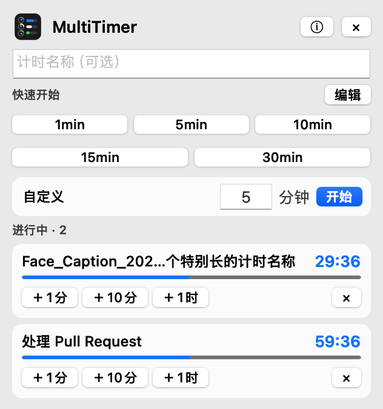

<div align="center">

# MultiTimer

轻量、原生的 macOS 菜单栏多任务倒计时。

[](https://github.com/EchoForger/multi-timer/releases/latest)
[](https://www.apple.com/macos/)
[](LICENSE)
[](https://echoforger.github.io/multi-timer/)

<picture>
  <source media="(prefers-color-scheme: dark)" srcset="dark.png">
  <source media="(prefers-color-scheme: light)" srcset="light.png">
  
</picture>

</div>

## 安装

### 直接下载

<p>
  <a href="https://github.com/EchoForger/multi-timer/releases/latest">
    
  </a>
</p>

打开最新 Release，在 **Assets** 中下载 `MultiTimer-<版本号>.dmg`，然后：

1. 打开 DMG。
2. 将 `MultiTimer.app` 拖入“应用程序”文件夹。
3. 启动 MultiTimer；计时器图标会出现在菜单栏中。

### Homebrew

```bash
brew tap EchoForger/multi-timer
brew install --cask multi-timer
```

以后更新到最新版本：

```bash
brew update
brew upgrade --cask multi-timer
```

卸载：

```bash
brew uninstall --cask multi-timer
```

## 首次打开

当前版本尚未经过 Apple 签名与公证。如果 macOS 阻止应用启动：

1. 在 Finder 中打开“应用程序”。
2. 右键点击 `MultiTimer.app`，选择“打开”。
3. 在确认窗口中再次点击“打开”。

也可以前往 **系统设置 → 隐私与安全性**，找到 MultiTimer 并选择“仍要打开”。此操作通常只需进行一次。

首次启动时，请允许 MultiTimer 发送通知，否则计时结束时无法显示提醒。

## 怎么用

1. 点击菜单栏中的计时器图标。
2. 输入任务名称，或留空让应用自动命名。
3. 点击预设时间，或输入自定义分钟数开始计时。
4. 运行中可以增加 1、10、60 分钟，也可以随时取消。
5. 时间到后，选择“重新计时”或“已检查”。

## 主要功能

- 同时运行多个倒计时
- 自定义快捷时间预设
- 进度条和最后 10 秒红色提示
- macOS 原生到时通知
- 自动跟随系统深浅主题
- 自动保存预设和未结束的任务
- 只驻留菜单栏，不占用 Dock
- 无账户、无遥测，数据仅保存在本机

本地状态文件位于：

```text
~/.config/multitimer/state.json
```

## 开源

MultiTimer 使用 Python、PyObjC 和 AppKit 构建，基于 [MIT License](LICENSE) 开源。欢迎提交 [Issue](https://github.com/EchoForger/multi-timer/issues) 和 Pull Request。
